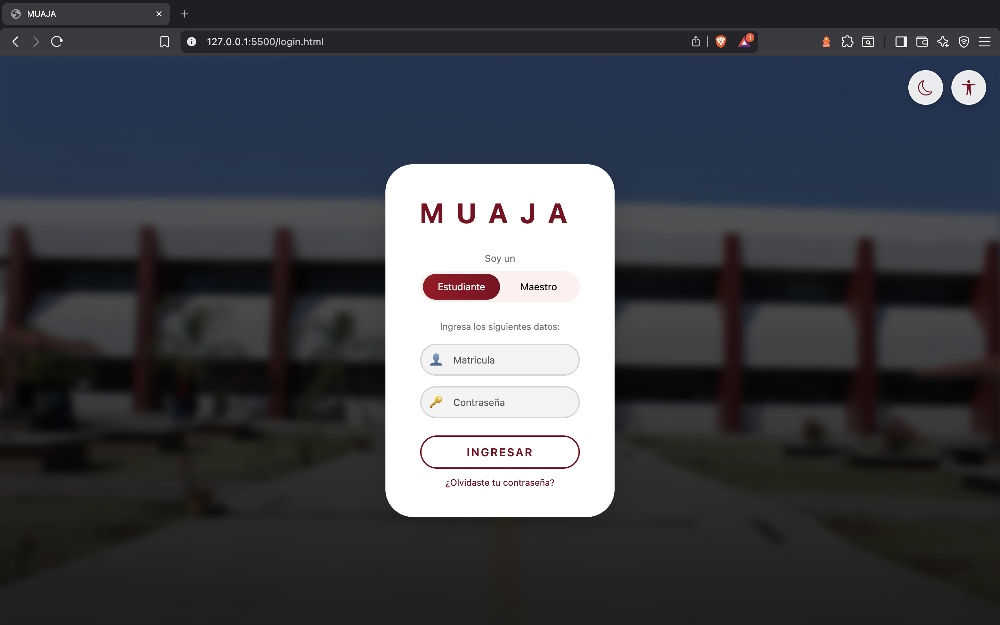
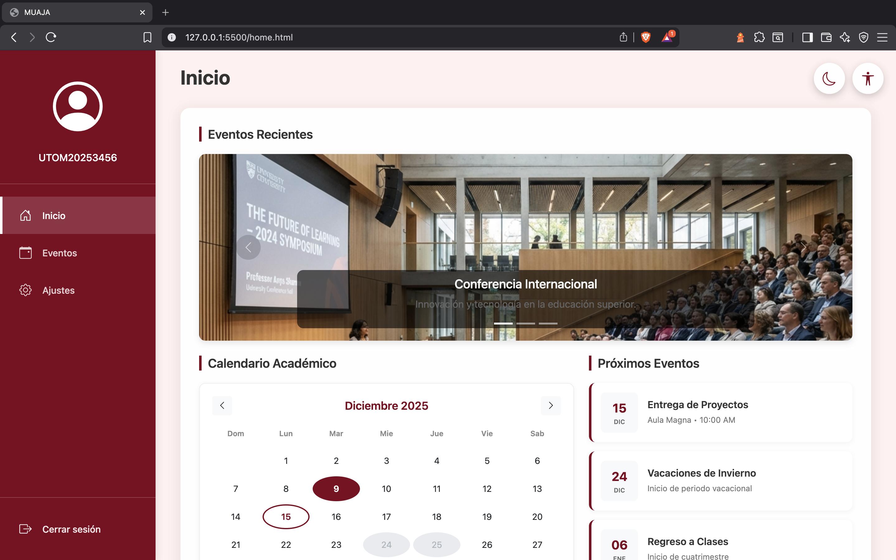
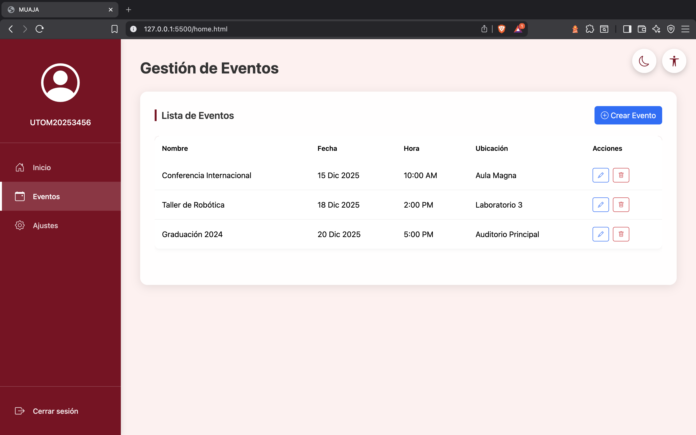
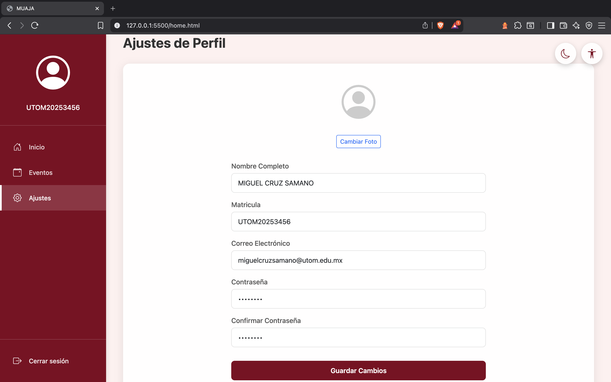

# MUAJA - Sistema de Gestión Académica

Sistema web de gestión académica para la Universidad Tecnológica de Oriente de Michoacán (UTOM).

## 📋 Descripción

MUAJA es una plataforma web moderna diseñada para la gestión de eventos académicos, perfiles de usuario y administración de información estudiantil. El sistema cuenta con una interfaz intuitiva y un diseño responsive que se adapta a diferentes dispositivos.

## ✨ Características

### 🔐 Sistema de Login

- Selector de rol (Estudiante/Maestro)
- Temas dinámicos (Guinda para Estudiante, Verde para Maestro)
- Validación de credenciales
- Diseño moderno con fondo personalizado

### 🏠 Dashboard Principal

- **Carrusel de Eventos Recientes**: Visualización de eventos destacados con imágenes
- **Calendario Académico**: Vista mensual interactiva con eventos marcados
- **Próximos Eventos**: Lista de eventos importantes próximos a realizarse

### 📅 Gestión de Eventos

- Tabla completa de eventos programados
- Crear nuevos eventos mediante modal
- Editar eventos existentes
- Eliminar eventos con confirmación
- Campos: Nombre, Fecha, Hora, Ubicación

### ⚙️ Configuración de Perfil

- Visualización de información personal
- Campos de perfil:
  - Nombre completo (solo lectura)
  - Matrícula (solo lectura)
  - Correo electrónico
  - Contraseña
  - Confirmación de contraseña
- Botón para guardar cambios

## 🎨 Diseño y Temas

El sistema implementa un sistema de temas dinámicos basado en el rol del usuario:

- **Tema Estudiante**: Colores Guinda/Maroon (#800020)
- **Tema Maestro**: Colores Verde (#198754)

Los temas se aplican consistentemente en:

- Barra lateral
- Botones y enlaces
- Elementos del calendario
- Modales y formularios

## 🛠️ Tecnologías Utilizadas

- **HTML5**: Estructura semántica
- **CSS3**: Estilos personalizados y variables CSS
- **JavaScript**: Lógica de interacción
- **Bootstrap 5.3.3**: Framework CSS y componentes
- **Bootstrap Icons**: Iconografía

## 🌟 Funcionalidades Principales

### Navegación

- **Inicio**: Dashboard con calendario y eventos
- **Eventos**: Gestión completa de eventos (CRUD)
- **Ajustes**: Configuración de perfil de usuario
- **Cerrar Sesión**: Regreso a la pantalla de login

## 👥 Autores

- Alejandro Balderas Rios.
- Jose Jesus Alvarado Gervacio.
- Leon Ulises Bautista Mendiola.
- Luis Antonio Mora Medina.
- Miguel Angel Cruz Samano

## 📄 Licencia

Este proyecto es de uso académico.

---

**MUAJA** - Sistema de Gestión Académica © 2025
